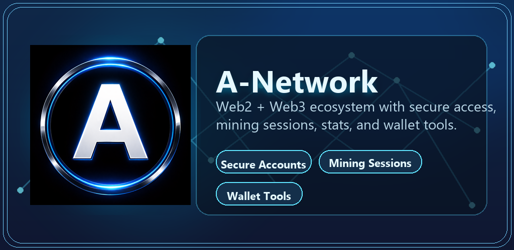

<div align="center">
  
  
</div>

---

### Mainframe Protocol

<div align="center">

<pre>
> Initiating A-Network startup sequence...
> Loading mobile mining interface... [COMPLETE]
> Connecting Fastify backend and PostgreSQL ledger... [ACTIVE]
> Syncing Web3 utility-token visibility layer... [RUNNING]
> Preparing Web4/Web5 migration narrative... [STAGED]
> Mission: build a long-term mining ecosystem with real product surfaces.
</pre>

</div>

---

### Primary System: A-Network Stack

<div align="center">

<pre>
> System Type   : Mobile Mining + Backend + Public Docs
> Core Focus    : Session rewards, token visibility, future Layer 1 migration
> Mission       : Connect app-native participation with broader network utility
> Status        : LIVE DEVELOPMENT
</pre>

</div>

A-Network is a full-stack product built around three linked layers:

- Web2 off-chain application services
- Web3 on-chain `21,000,000 ANET` utility-token visibility and wallet integration on BNB Smart Chain
- Web4/Web5 coordination concepts connecting the Web3 utility token to a separate `ANTS -> ANET` Layer 1 mining economy

The current product includes a Flutter app, a Node.js/Fastify backend, a PostgreSQL database, public legal pages, and a public website surface.

---

### Live System Status

<p align="center">
  
  
  
  
</p>

<div align="center">

<pre>
> Node Status        : SYNCHRONIZED
> Mining Sessions    : 6-HOUR VALIDATED CYCLES
> Web3 Surface       : ANET CONTRACT LOOKUP ENABLED
> Build State        : CONTINUOUS DELIVERY READY
</pre>

</div>

---

### System Modules

<p align="center">
  
  
  
  
</p>

<p align="center">
  
  
  
  
</p>

<p align="center">
  
  
  
  
</p>

---

### Current Product Scope

<div align="center">

<pre>
> Auth Layer        : REGISTER / LOGIN / JWT
> Mining Engine     : SESSION-BASED OFF-CHAIN REWARD ACCOUNTING
> Stats Surface     : GLOBAL STATS + LEADERBOARD ENDPOINTS
> Wallet Layer      : ON-CHAIN ANET BALANCE LOOKUP
> Docs Surface      : WEBSITE + PRIVACY + TERMS + WHITEPAPER
</pre>

</div>

The codebase currently implements:

- User registration and login with JWT-based authentication
- A 6-hour session-based off-chain mining engine
- Global stats and leaderboard endpoints
- On-chain ANET balance lookup through the deployed token contract
- Flutter mobile UI with multi-slide product narrative
- In-app legal links for Privacy Policy and Terms of Service
- Public docs pages for website, privacy, and terms

The codebase does not currently implement:

- Guaranteed financial returns
- Brokerage or custodial financial services
- Automatic off-chain to on-chain reward minting for users
- A production claim bridge from off-chain app balance into on-chain wallet balance

---

### Policy Guardrails

<div align="center">

<pre>
> Notice            : LONG-TERM ECOSYSTEM PROJECT
> Financial Claim   : NOT INVESTMENT ADVICE
> Return Guarantee  : NONE
> Store Messaging   : FACTUAL / RISK-AWARE / POLICY-SAFE
</pre>

</div>

Important notice:

- A-Network is a long-term ecosystem project.
- It is not financial advice.
- It does not promise guaranteed earnings, guaranteed returns, or token appreciation.
- Store listing text, website text, and in-app text should remain factual, risk-aware, and compliant with Google Play and App Store policies.

## Actual Tech Stack

Backend:

- Node.js
- Fastify
- PostgreSQL
- JWT
- bcryptjs
- dotenv

Frontend:

- Flutter
- Dart
- http
- shared_preferences
- google_mobile_ads
- video_player
- webview_flutter
- url_launcher

Website / Docs:

- Static HTML in `docs/`
- GitHub Pages compatible structure

## Repository Structure

```text
A Network/
├── backend/
│   ├── db.js
│   ├── database_schema.sql
│   ├── server.js
│   ├── middleware/
│   ├── routes/
│   └── services/
├── docs/
│   ├── index.html
│   ├── privacy.html
│   └── terms.html
├── my_app/
│   ├── lib/
│   ├── assets/
│   ├── web/
│   └── pubspec.yaml
└── README.md
```

## Mining Logic In Code

The current backend mining rules are defined in:

- `backend/services/miningEngine.js`
- `backend/services/halving.js`
- `backend/routes/mining.js`

### Mining Session Duration

- One mining session lasts exactly `21,600` seconds
- This equals `6` hours

### Base Rate

```text
LAUNCH_REWARD_ANET = 0.04882812 ANET/session
LAUNCH_REWARD_ANTS = 4,882,812 ants/session
LAUNCH_PHASE_SESSIONS = 500,000 total sessions
POST_LAUNCH_BASE_REWARD_ANET = 0.00262144 ANET/session
POST_LAUNCH_BASE_REWARD_ANTS = 262,144 ants/session
POST_LAUNCH_HALVING_INTERVAL = 3,800,000,000 total sessions
MAX_HALVING_STAGE = 9
MAX_SUPPLY = 21,000,000 ANET
```

### Current Rate Formula

```text
if totalSessions < 500000:
  rewardPerSession = 0.04882812 ANET
else:
  halvingStage = min(floor((totalSessions - 500000) / 3800000000), 9)
  rewardPerSession = 0.00262144 / (2 ^ halvingStage)
```

### Reward Formula

```text
rewardAnts = floor(rewardPerSession x 100,000,000)
rewardAnet = rewardAnts / 100,000,000
```

Examples:

- `launch tranche` -> `0.04882812 ANET` (`4,882,812` ants) for the first `500,000` total sessions
- `post-launch stage = 0` -> `0.00262144 ANET` (`262,144` ants)
- `stage = 1` -> `0.00131072 ANET` (`131,072` ants)
- `stage = 2` -> `0.00065536 ANET` (`65,536` ants)
- `stage = 9` -> `0.00000512 ANET` (`512` ants, capped final stage)

### Eligibility Rule

A user becomes eligible for the network halving calculation only when:

```text
successful_sessions >= 1000
```

### Halving Stage Formula

```text
totalSessions = sum(users.successful_sessions)
halvingStage = min(floor((max(totalSessions - 500000, 0)) / 3800000000), 9)
```

Examples:

- `0` to `499,999` sessions -> launch tranche reward
- `500,000` to `3,800,499,999` sessions -> post-launch stage 0
- `3,800,500,000` to `7,600,499,999` sessions -> stage 1
- `7,600,500,000` to `11,400,499,999` sessions -> stage 2
- `34,200,500,000+` sessions -> stage 9

### User Rules Enforced By The API

- User must be authenticated to start and complete mining
- User must exist in the database
- User cannot start a second session while `is_mining = true`
- User cannot complete mining before 6 full hours pass
- On successful completion:
  - user `balance` increases
  - `successful_sessions` increments by 1
  - `is_mining` becomes `false`

### Supply Protection Rules

- If `total_mined_ants >= MAX_SUPPLY_ANTS`, mining rewards stop
- If `total_mined_ants + rewardAnts > MAX_SUPPLY_ANTS`, reward is reduced to the exact remaining supply
- Claim conversion uses safe truncation to ensure total claimed ANET never exceeds max supply
- When max supply is reached, `is_mining_active` is disabled in network stats

## Security and Anti-Abuse (v1.0.2)

- Device binding with configurable max accounts per device (default `2`)
- Heartbeat-backed mining session validation before completion
- Risk scoring and account/session flagging
- Claim gate for flagged or high-risk accounts
- Security audit logs for sensitive auth/mining events
- Global API rate limiting baseline: `100 requests / 15 minutes / IP`

## Web2, Web3, and Web4 Positioning

### Web2 Layer

The current application includes an off-chain session engine, user accounts, ranking, app-native progression, and backend-controlled reward accounting.

### Web3 Layer

The current application and website can read ANET utility-token information from the deployed token contract on BNB Smart Chain. In the current public model, this Web3 token is a fixed-supply ecosystem utility asset with a total supply of `21,000,000 ANET` and a documented stewardship split of `50% owner / 50% founder` for ecosystem distribution, liquidity, partnerships, and long-term Layer 1 access planning.

Contract address:

```text
0x791055A7d52AA392eaE8De04250497f33807E46A
```

### Web4 Layer

Web4 is currently presented as the coordination layer between off-chain utility and on-chain ownership. In the current project narrative, Web4/Web5 uses a separate Layer 1 ANET/ANTS mining economy: miners accumulate ANTS through validated 6-hour sessions, the first `1,000` completed sessions act as a non-spendable genesis threshold, and only after that threshold can ANTS be converted into spendable Layer 1 ANET through the governed migration flow. The ANTS Program serves as the gateway into that culture, which means developers, aligned investors, and contributors are expected to participate as miners and organize through colony groups rather than join as passive observers. This Layer 1 mining economy is intended to be `100% mining-based` with `0% owner allocation` and `0% founder allocation`.

## Token Model And Distribution

### Web3 Utility Token On BNB Chain

- Asset role: ecosystem utility token and external market visibility layer
- Network: BNB Smart Chain
- Supply: `21,000,000 ANET`
- Stewardship: `50% owner / 50% founder`
- Intended uses: ecosystem growth, market discovery, liquidity planning, partner distribution, and future buy-in rails for the Layer 1 economy
- Current public contract:

```text
0x791055A7d52AA392eaE8De04250497f33807E46A
```

### Web4/Web5 Layer 1 Coin Economy

- Separate from the BNB Chain utility token
- Accounting model: users mine `ANTS` first and convert into Layer 1 `ANET` only after eligibility
- Genesis threshold: the first `1,000` completed sessions are a non-spendable participation threshold
- Conversion rule: after `1,000` completed sessions, miners become eligible to convert accumulated ANTS into spendable Layer 1 ANET through the project migration and settlement flow
- Participation gateway: contributors, developers, and aligned investors enter through the ANTS Program and are expected to mine inside colony groups
- Distribution: `100% mining/community distribution`
- Founder allocation: `0%`
- Owner allocation: `0%`
- Economic principle: everyone participates as miners; the Layer 1 coin economy is not presented as a pre-allocated insider reserve

### Roadmap Framing

- The current codebase already implements the ANTS-first session ledger and the `1,000`-session eligibility threshold
- The ANTS Program is positioned as the contributor gateway, where meaningful participation is expected to happen through mining and colony-group membership
- The BNB Chain utility token is already visible through the current wallet and website surfaces
- The broader Layer 1 public-release target is currently described as a roadmap goal with an approximate `8-month` objective, subject to technical readiness, security review, and market conditions
- Any early Layer 1 starting price discussion should be treated as a non-guaranteed planning reference only; market price discovery will depend on open participation and liquidity at launch

## Backend Setup

### Install Dependencies

```bash
cd backend
npm install
```

### Database Setup

Create a PostgreSQL database and load the schema:

```bash
psql -U postgres -d anetwork -f database_schema.sql
```

### Backend Environment

Example `.env`:

```env
PORT=3000

DB_USER=postgres
DB_HOST=localhost
DB_NAME=anetwork
DB_PASS=your_password
DB_PORT=5432

JWT_SECRET=ANET_SECRET_KEY

ANET_CONTRACT=0x791055A7d52AA392eaE8De04250497f33807E46A
ANET_DECIMALS=18
BSCSCAN_API_URL=https://api.bscscan.com/api
BSCSCAN_API_KEY=
```

### Start Backend

```bash
npm start
```

`npm start` now runs `backend/server.js` (Fastify API with ANTS-first mining, wallet, and forgot-password OTP routes).

## Flutter App Setup

```bash
cd my_app
flutter pub get
flutter run
```

Current app capabilities include:

- login and register
- mining slide
- main dashboard slide
- web3 slide with in-app browser and wallet actions
- web4 concept slide
- whitepaper, privacy, and terms slide

Current app build command:

```bash
flutter build apk --release --no-obfuscate
```

## API Surface

Authentication:

- `POST /auth/register`
- `POST /auth/login`

Mining:

- `POST /mining/start`
- `GET /mining/status/:userId`
- `POST /mining/complete`

Stats:

- `GET /stats/network`
- `GET /stats/onchain/:address`

Leaderboard:

- `GET /leaderboard/top`
- `GET /leaderboard/rank/:userId`

User:

- `POST /user/create`

## Website And Legal Pages

The docs folder contains the public website and legal pages:

- `docs/index.html`
- `docs/privacy.html`
- `docs/terms.html`

Recommended public URLs:

- `https://a-network.net/`
- `https://a-network.net/privacy.html`
- `https://a-network.net/terms.html`

For the favicon to work, `logo.png` should be published in the same docs web root.

## Policy-Safe Messaging Guidelines

When preparing store listings, screenshots, ads, and marketing copy, keep messaging aligned with the real implementation.

Safe principles:

- Describe the app as a long-term ecosystem or session-based reward product
- Avoid promising profit, guaranteed income, or guaranteed token value
- Clearly separate off-chain app balance, the BNB Chain utility token, and the future Layer 1 mining coin economy
- Keep privacy and terms URLs public and accessible
- Label roadmap allocations and launch targets as roadmap items, not as already-enforced code behavior

Avoid claiming:

- guaranteed returns
- guaranteed price growth
- guaranteed launch price
- financial services that are not implemented
- unsupported token allocations that are not documented in the official project materials
- features that imply regulatory approval when none is shown in code or docs

## Legal Links

- Privacy Policy: `https://a-network.net/privacy.html`
- Terms of Service: `https://a-network.net/terms.html`

## Contact

- Email: `info@a-network.net`
- GitHub: `https://github.com/A-Network-2026`
- X: `https://x.com/AAlphaNetwork`

## Summary

A-Network currently ships as a real application stack with:

- code-backed off-chain mining logic
- code-backed network stats and leaderboard behavior
- code-backed on-chain ANET balance lookup
- public legal pages
- policy-safer product positioning for app store submission

Any future README updates should stay aligned with the actual source code, legal pages, and store-policy-safe language.
2. Build optimized release:
```bash
flutter build apk --release    # Android
flutter build ipa --release    # iOS
flutter build web --release    # Web
```


## 📝 Environment Variables

```env
PORT                - Server port (default: 3000)
DB_USER            - PostgreSQL username
DB_HOST            - Database host
DB_NAME            - Database name
DB_PASS            - Database password
DB_PORT            - Database port (default: 5432)
JWT_SECRET         - Secret key for JWT signing
```


## 🐛 Troubleshooting

### "Database connection error"
- Verify PostgreSQL is running
- Check .env credentials
- Ensure database exists: `createdb anetwork`

### "Mining failed: User not found"
- Register new account first
- Verify JWT token is valid

### "Already mining"
- Wait for current session to complete
- Or reset is_mining flag in database

### "Connection refused to API"
- Check backend server is running
- Verify correct API URL in `api.dart`
- For Android emulator, use machine IP instead of localhost

### Flutter video not loading
- Ensure `assets/video.mp4` exists
- Add to `pubspec.yaml` correctly
- Run `flutter pub get`


## 📈 Future Features

- [ ] Real blockchain integration
- [ ] Multiple mining pools
- [ ] Advanced analytics dashboard
- [ ] Social features (referrals, teams)
- [ ] Hardware acceleration support
- [ ] Mobile notification system
- [ ] WebSocket live updates
- [ ] Payment gateway integration


## 📄 License

ISC License

## 👨‍💻 Support

For issues or questions:
1. Check logs in backend console
2. Verify database schema
3. Test API endpoints with curl
4. Check Flutter console debug output

---

**⛏️ Happy Mining! 🚀**
